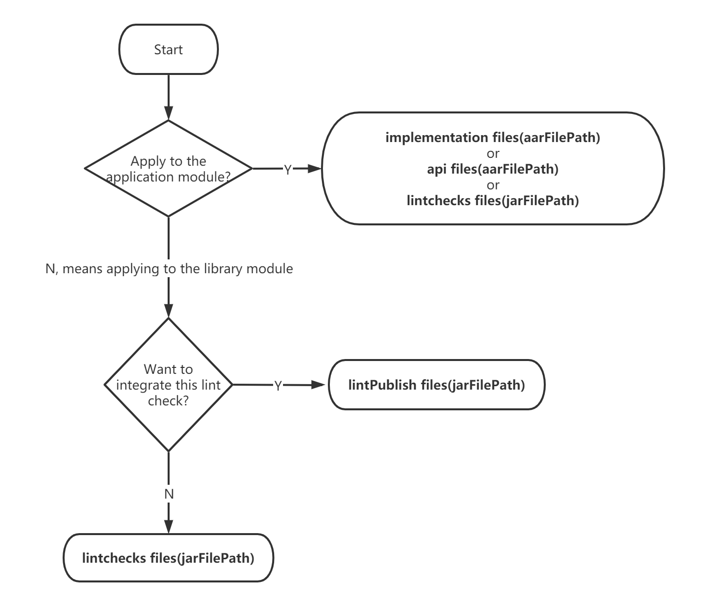
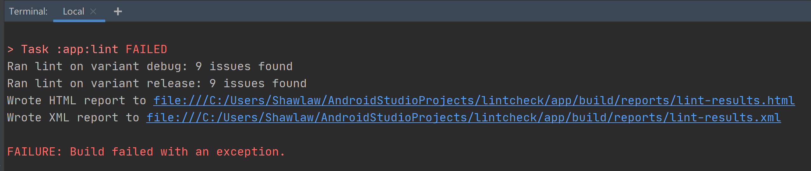
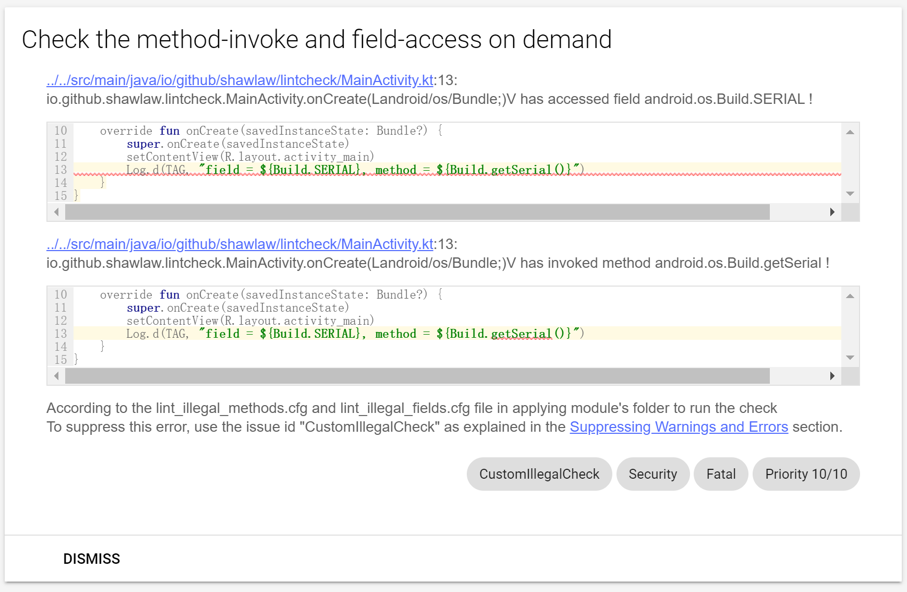
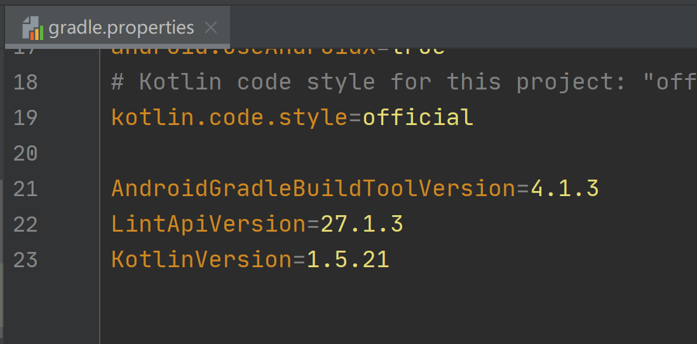
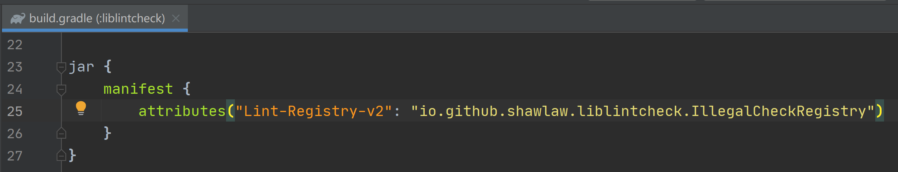

# Custom Android Lint Check

This project provides a custom Android lint check to detect if there are any unwanted method-invoke or field-access in your Android application/library.

It is done by scanning classes files so that it can check the **WHOLE** project, **including any third-part-lib your project is using**.


## Demo

Clone this project and run lint check of app module

```
gradlew :app:lint
```

The check result will be listed in html report under name **CustomIllegalCheck**, the issue id of this lint check.


## Usage

Firstly ensure your project's Android gradle build tool version is at least **4.1.3** and kotlin version is at least **1.5.21**.

If not, try upgrade your project or build your own lint-check jar/aar from this project after change the versions in **gradle.properties**. Read more in next section.

Then download aar/jar from [release page](https://github.com/Shawlaw/CustomLintCheck/releases) and put it in your project.

**Jar is more recommended.**




Take jar for usage example, putting it in app/libs folder, name **liblintcheck.jar**

Then in the **build.gradle** script of app module, we should add following code:

```groovy
// app/build.gradle

...Any other configs...

android {
    ...Any other configs...

    lintOptions {
        ...Any other configs...

        // Add this to ensure lint will check any other dependency modules
        // See more from https://developer.android.com/reference/tools/gradle-api/7.0/com/android/build/api/dsl/LintOptions
        checkDependencies true
    }
}

dependencies {
    ...Any other dependencies...

    lintChecks files("libs/liblintcheck.jar")
}
```

And then configurate the checking methods/fields in config file, each line indicates one checking item.

Methods should be list in **lint_illegal_methods.cfg** in app folder:

```bash
# app/lint_illegal_methods.cfg

# Lines that starting with "#" are the comment lines, won't be taking as checking item. Other lines indicate one checking item each.
# Next line indicates that any usage of the getSerial() method in class android.os.Build should be detected
android.os.Build.getSerial
```

Fields should be list in **lint_illegal_fields.cfg** in app folder:

```bash
# app/lint_illegal_fields.cfg

# Lines that starting with "#" are the comment lines, won't be taking as checking item. Other lines indicate one checking item each.
# Next line indicates that any usage of the SERIAL field in class android.os.Build should be detected
android.os.Build.SERIAL
```

Finally, run the lint check from terminal:

```
gradlew :app:lint
```

In the output of terminal we should see the path of HTML report.



Open it in the browser then we will see the checking result.




## Build your own lint-check aar/jar

1. Clone this project

2. Change versions in **gradle.properties** on your demand, may also need to adjust code of *io.github.shawlaw.liblintcheck.IllegalCheckClassScanner* and *io.github.shawlaw.liblintcheck.IllegalCheckRegistry*

   

3. If you have changed the class name of *io.github.shawlaw.liblintcheck.IllegalCheckRegistry*, you also need to change the one in **build.gradle** script of **liblintcheck** module

   

4. To build aar, run gradle build task of **publishlint** module in terminal

   ```bash
   gradlew :publishlint:build
   ```

   The aar will be built in folder .\publishlint\build\outputs\aar

5. To build jar, run gradle build task of **liblintcheck** module in terminal

   ```bash
   gradlew :liblintcheck:build
   ```

   The jar will be built in folder .\liblintcheck\build\libs


## Refs

https://github.com/googlesamples/android-custom-lint-rules

https://developer.android.com/reference/tools/gradle-api/7.0/com/android/build/api/dsl/LintOptions

https://developer.android.com/studio/write/lint

https://medium.com/@vanniktech/writing-your-first-lint-check-39ad0e90b9e6